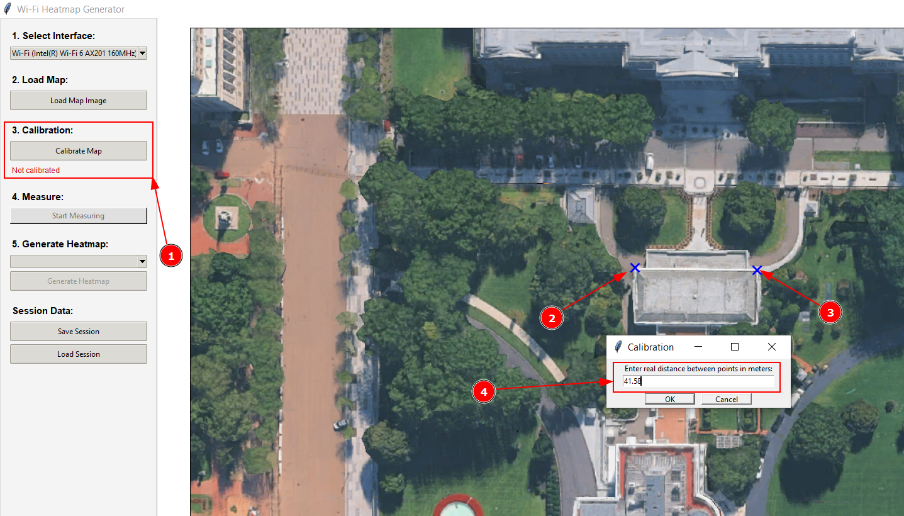
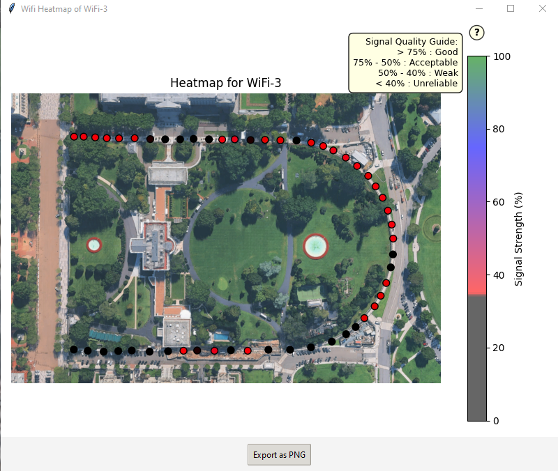

# Wi-Fi Heatmap <!-- omit in toc -->

A cross-platform Python GUI application that allows you to map Wi-Fi signal strength over a floor plan or map image. By taking signal measurements at various points in a physical space, the tool generates an interpolated, physics-based heatmap to visualize your exact network coverage.

**Example**:


## NOTES <!-- omit in toc -->

- Not tested on MAC
- Not tested with 6GHz Wi-Fi

## Table of content <!-- omit in toc -->

- [Installation](#installation)
- [OS-Specific Requirements](#os-specific-requirements)
- [How to Use](#how-to-use)
  - [Windows CMD](#windows-cmd)
  - [Windows PowerShell](#windows-powershell)
  - [Linux](#linux)
  - [Step-by-Step Guide](#step-by-step-guide)
- [How it Works](#how-it-works)
  - [Architecture Overview](#architecture-overview)
  - [Application Lifecycle](#application-lifecycle)
    - [1. Interface Detection (`load_interfaces`)](#1-interface-detection-load_interfaces)
    - [2. Map Loading (`load_map`)](#2-map-loading-load_map)
    - [3. Calibration (`start_calibration` → `on_map_click`)](#3-calibration-start_calibration--on_map_click)
    - [4. Measurement (`toggle_measuring` → `on_map_click` → `scan_wifi_once`)](#4-measurement-toggle_measuring--on_map_click--scan_wifi_once)
    - [5. Heatmap Generation (`generate_heatmap`)](#5-heatmap-generation-generate_heatmap)
    - [6. Session Persistence (`save_session` / `load_session`)](#6-session-persistence-save_session--load_session)
  - [The Physics](#the-physics)
- [Signal Conversion: dBm to Percentage](#signal-conversion-dbm-to-percentage)
  - [The Formula](#the-formula)
  - [Why This Matters](#why-this-matters)
- [Debugging](#debugging)
- [License](#license)

## Installation

1. **Clone the repository:**

   ```bash
   git clone https://github.com/J0nan/Wi-Fi_HeatMap
   cd Wi-Fi_HeatMap
   ```

2. **Create a virtual environment**

   ```bash
   python -m venv Wi-Fi_HeatMap
   ```

3. **Activate virtual environment**

   ```bash
   # Linux
   source ./Wi-Fi_HeatMap/bin/activate

   # Windows
   .\Wi-Fi_HeatMap\Scripts\activate.bat
   ```

4. **Install the required dependencies:**

   ```bash
   pip install -r requirements.txt
   ```

## OS-Specific Requirements

- **Windows:** Works out of the box using `netsh`. The `pywifi` library is also supported and recommended (it is installed with the `requirements.txt`).
<!-- WILL HAVE TO CHECK WITH A MAC * **macOS:** Utilizes the hidden `airport` system utility (`/System/Library/PrivateFrameworks/Apple80211.framework/Versions/Current/Resources/airport`). **Note:** You may need to grant terminal/Python location or network scanning permissions in macOS System Settings. -->
- **Linux:** Requires NetworkManager (`nmcli`) to be installed and active. Scanning requires sufficient privileges; running as `sudo` might be necessary depending on your distro's network permissions.

## How to Use

Run the application from your terminal:

### Windows CMD

```bash
.\Wi-Fi_HeatMap\Scripts\activate.bat
python Wi-Fi-heatmap.py
```

### Windows PowerShell

```bash
Set-ExecutionPolicy -Scope Process -ExecutionPolicy RemoteSigned -Force
.\Wi-Fi_HeatMap\Scripts\activate.ps1
python Wi-Fi-heatmap.py
```

### Linux

```bash
source ./Wi-Fi_HeatMap/bin/activate
python Wi-Fi-heatmap.py
```

### Step-by-Step Guide

1. **Select Interface:** Choose your active Wi-Fi adapter from the dropdown on the left panel.
2. **Load Map:** Click **Load Map Image** and select a floor plan of your space (PNG, JPG, BMP).

3. **Calibration:**
   - Click **Calibrate Map**.
   - Click on two points on the map where you know the real-world distance between them.
   - Enter the distance in meters when prompted. This scales the physics engine.

4. **Measure:**
   - Adjust your **Measurement Radius (m)**.
   - Click **Start Measuring**.
   - Walk to a location in the real world, and click that exact location on the digital map.
   - *The app will take 3 rapid scans to average the environment, grab the exact frequencies of all nearby APs, and plot a red dot on your map.*

5. **Generate Heatmap:**
   - Select the target network (SSID) from the dropdown.
   - Click **Generate Heatmap**. A new window will pop up with your colored Wi-Fi footprint.


6. **Save/Export:** Export the final image as a PNG, or click **Save Session** on the sidebar to save your raw data and map into a single file for later use.

## How it Works

This section is aimed at developers who want to understand the codebase. The entire application lives in a single file [Wi-Fi-heatmap.py](Wi-Fi-heatmap.py) built around the `WifiHeatmapApp` class.

### Architecture Overview

```text
┌──────────────────────────────────────────────────────────┐
│                        main()                            │
│  Creates Tk root → WifiHeatmapApp(root) → mainloop()     │
└──────────────────────────────────────────────────────────┘
                           │
                           ▼
┌──────────────────────────────────────────────────────────┐
│                  WifiHeatmapApp.__init__                 │
│  1. Detects OS (platform.system())                       │
│  2. Sets up UI (setup_ui)                                │
│  3. Discovers Wi-Fi interfaces (load_interfaces)         │
└──────────────────────────────────────────────────────────┘
```

The application is a **finite-state machine** that transitions between states driven by user actions:

| State | Meaning | Triggered by |
| --- | --- | --- |
| `IDLE` | Default resting state | Startup, or finishing calibration/measuring |
| `CALIBRATING` | Waiting for two reference clicks on the map | "Calibrate Map" button |
| `MEASURING` | Each click triggers a Wi-Fi scan at that position | "Start Measuring" toggle |

### Application Lifecycle

#### 1. Interface Detection (`load_interfaces`)

On startup the app enumerates available Wi-Fi adapters using the OS-native backend:

| OS | Backend | Data source |
| --- | --- | --- |
| Windows | `pywifi` library (preferred) or `netsh wlan show interfaces` | Adapter name + description |
| Linux | `nmcli -t -f DEVICE,TYPE device` | Devices with type `wifi` |
| macOS | `networksetup -listallhardwareports` | Entries under "Hardware Port: Wi-Fi" |

The detected interfaces populate the sidebar dropdown. An internal `interfaces_map` dictionary maps each display string to its OS-level handle (a `pywifi.Interface` object on Windows, or a plain interface name string on Linux/macOS).

#### 2. Map Loading (`load_map`)

The user selects an image file (PNG/JPG/BMP). The image is opened with **Pillow**, converted to RGB, and stored as a **NumPy array** in `self.original_image`. It is rendered on a **Matplotlib** figure embedded inside the Tkinter window via `FigureCanvasTkAgg`. A black border is drawn around the image edges to provide a visual boundary and enforce that clicks outside the image are discarded.

#### 3. Calibration (`start_calibration` → `on_map_click`)

Calibration establishes the **pixel-to-meter ratio** required by the physics engine:

1. The user clicks two points on the map whose real-world distance is known.
2. A dialog asks for that distance in meters.
3. The Euclidean pixel distance between the two clicks is divided by the real-world distance to produce `self.pixels_per_meter`.

This ratio is used later to convert pixel distances on the grid into physical meters, which in turn feed into the Free-Space Path Loss formula.

#### 4. Measurement (`toggle_measuring` → `on_map_click` → `scan_wifi_once`)

When in `MEASURING` state, each click on the map:

1. **Validates** that the Wi-Fi adapter is still powered on (`is_wifi_on`).
2. **Performs 3 sequential Wi-Fi scans** (`scan_wifi_once` × 3) with a 1-second pause between them.
3. **Averages** the signal strength across scans for each detected SSID.
4. **Stores** the result as a dictionary appended to `self.measurements`:

```python
{
    'x': int,         # Pixel X coordinate on the map
    'y': int,         # Pixel Y coordinate on the map
    'ssids': {
        'NetworkName': {
            'signal': int,   # Normalized 0–100 % (see dBm conversion below)
            'freq': float    # Center frequency in MHz (e.g., 2437.0, 5180.0)
        },
        ...
    }
}
```

The `scan_wifi_once` method is the OS-abstraction layer. It calls the native scanning tool, parses its output, and returns a dict of `{ssid: {signal, freq}}`:

| OS | Tool | Signal source | Frequency source |
|---|---|---|---|
| Windows (`pywifi`) | `interface.scan()` → `scan_results()` | Raw dBm from driver | `network.freq` (auto-detected unit) |
| Windows (`netsh`) | `netsh wlan show networks mode=bssid` | Percentage → converted to dBm → normalized | Channel number → `channel_to_freq()` |
| Linux | `nmcli dev wifi list` | Percentage → converted to dBm → normalized | Frequency field in MHz |
| macOS | `airport -s` | Raw dBm (RSSI column) | Channel number → `channel_to_freq()` |

A helper function `channel_to_freq()` maps Wi-Fi channel numbers to their center frequency in MHz, covering the 2.4 GHz (channels 1-14), 5 GHz (36-165), and 6 GHz (1-233) bands.

#### 5. Heatmap Generation (`generate_heatmap`)

This is the core computation. Given all measurement points for a selected SSID, the algorithm produces a 2D signal-strength grid over the entire map:

1. **Grid creation:** A 200×200 evaluation grid is built over the image dimensions using `np.mgrid`.

2. **Per-measurement propagation loop:** For each measurement point `(xi, yi)` with signal `zi_percent` at frequency `freq_mhz`:

   a. **Back-convert percentage → dBm:**

   $$dBm = \left(\frac{percent \times 60}{100}\right) - 100$$

   b. **Reverse FSPL → virtual AP distance:** Using a reference transmit power of 0 dBm, the path loss observed at the measurement point is inverted to find how far the AP *appears* to be:

   $$d_{AP} (km) = 10^{\frac{PathLoss - 20\log_{10}(f) - 32.44}{20}}$$

   c. **Forward FSPL → predict signal at every grid cell:** The total distance from the virtual AP to each grid cell is `d_AP + d_cell`, where `d_cell` is the physical distance (meters → km) from the measurement point to the grid cell. The predicted dBm is then:

   $$predicted_{dBm} = 0 - FSPL(d_{total}, f) - 1.2 \times d_{cell}$$

   The `1.2 × d_cell` term is an **indoor absorption penalty** that simulates wall/furniture attenuation and forces realistic signal decay.

   d. **Convert to linear milliwatts:** `predicted_mW = 10^(predicted_dBm / 10)`

3. **Inverse Distance Weighting (IDW) blending:** Each measurement's predicted milliwatt grid is accumulated using weights `w = 1 / (distance² + ε)`. This ensures nearby measurement points dominate, while distant ones contribute less.

4. **Back-conversion:** The blended milliwatt grid is converted back to dBm (`10 × log10`), then to percentage, and finally clipped to `[0, 100]`.

5. **Transparency masking:** Any grid cell below 35% signal strength is masked out (`NaN`), rendering it fully transparent over the floor plan.

6. **Visualization:** The heatmap is overlaid on the floor plan in a new Toplevel window using a custom colormap (`red → blue → green`), where green = strong signal and red = weak signal. A colorbar and the original measurement dots are also shown.

#### 6. Session Persistence (`save_session` / `load_session`)

Sessions are stored as a single `.json` file containing:

```json
{
    "image_base64": "<base64-encoded PNG of the floor plan>",
    "pixels_per_meter": 42.5,
    "measurements": [ ... ]
}
```

The map image is **embedded as base64** directly in the JSON, making sessions fully portable across machines (no dependency on a local file path). On load, the base64 is decoded back into a Pillow `Image`, converted to a NumPy array, and all UI state (calibration label, button states, SSID dropdown) is restored.

### The Physics

This application converts all signals back to their linear physical power equivalent (milliwatts) and routes them through a theoretical environmental decay model:

$$Loss (dB) = 20 \log_{10}(d) + 20 \log_{10}(f) + 32.44$$

Where:

- **d** = distance in kilometers (derived from your map calibration).
- **f** = the exact frequency of the AP in MHz (dynamically scraped during the scan, automatically adjusting decay rates for 2.4 GHz, 5 GHz, or 6 GHz networks).

The resulting physical power is then mathematically blended and converted back into an intuitive `0-100%` UI scale.

## Signal Conversion: dBm to Percentage

All signal strengths in the application are normalized to a **0 – 100 %** scale using a strict linear mapping anchored at two reference points:

| dBm | Percentage | Meaning |
| --- | --- | --- |
| **-40 dBm** | **100 %** | Excellent — essentially next to the AP |
| **-100 dBm** | **0 %** | No usable signal |

### The Formula

The conversion is performed by the `dbm_to_percent` function (defined inside `scan_wifi_once`):

```python
def dbm_to_percent(dbm_val):
    return max(0, min(100, int(round((dbm_val + 100.0) * 100.0 / 60.0))))
```

Mathematically:

$$\text{percent} = \text{clamp}\left(\operatorname{round}\left(\frac{\text{dBm} + 100}{60} \times 100\right),\, 0,\, 100\right)$$

The 60 in the denominator comes from the dynamic range: `-40 - (-100) = 60 dB`.

### Why This Matters

Different operating systems report Wi-Fi signal in different units:

| OS / Tool | Native unit | What the app does |
| --- | --- | --- |
| `pywifi` (Windows) | Raw dBm | Direct → `dbm_to_percent` |
| `netsh` (Windows) | Proprietary 0-100 % | Reverse-map to dBm via `dBm = (win% / 2) - 100`, then normalize |
| `nmcli` (Linux) | 0-100 % | Same reverse-map as Windows netsh |
| `airport` (macOS) | Raw dBm (RSSI) | Direct → `dbm_to_percent` |

By funnelling every backend through the same dBm → percentage pipeline, measurements are **consistent across platforms and across scanning backends** on the same OS (e.g., `pywifi` vs `netsh` on Windows will produce the same percentage for the same physical signal).

## Debugging

The application includes a logging system. If you are experiencing issues with Wi-Fi adapters not scanning or map generation failing, launch the app with an elevated log level:

```bash
python main.py --log-level DEBUG
```

Available levels: `DEBUG`, `INFO`, `WARNING`, `ERROR`, `CRITICAL`.

## License

This project is licensed under the GPL-3.0 license - see the [LICENSE](LICENSE) file for details.
